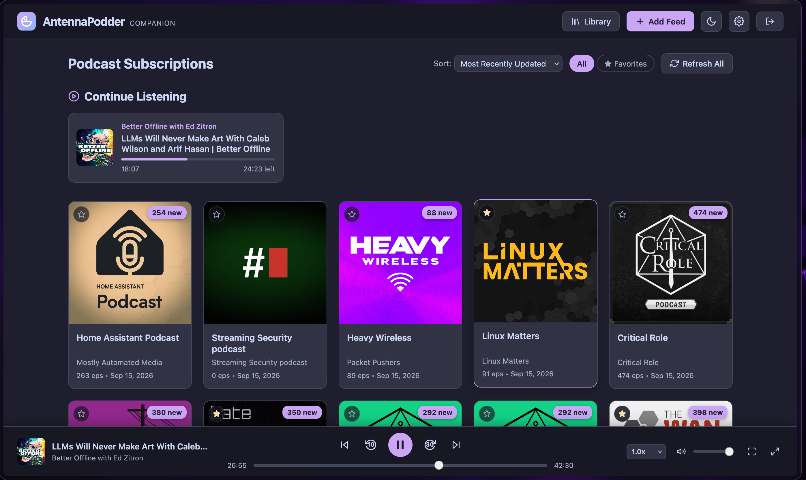

# AntennaPodder

AntennaPodder is a lightweight, standalone companion web player and synchronization server for the [AntennaPod](https://antennapod.org/) Android application.

It is not associated in any way with the AntennaPod or gPodder projects.

**Full Disclosure: This app was 100% coded with Gemini. Use at your own risk.**

I am vehemently opposed to exposing this directly directly to the internet. Put it behind a firewall and access the sync endpoint over a VPN.

## Screenshots



---

## Key Features

- **Reliable 2-Way Sync with AntennaPod:**
  - Changes in AntennaPod (subscriptions, playback progress, played status) sync to the web app.
  - Changes in the web app (adding feeds, removing feeds, listening, scrubbing, marking played) immediately sync back to AntennaPod.
  - Dual protocol support: compatible with both AntennaPod's **Nextcloud** provider and standard **gpodder.net** provider.
  - Non-destructive sync safeguards: connecting a fresh AntennaPod install or signing in on a new device never wipes existing podcasts or playback states.
- **Continue Listening:**
  - Dedicated "Continue Listening" shelf on the main library view displaying in-progress episodes with visual completion bars and remaining duration for quick one-click resumption.
- **Audio and Video Playback:**
  - Full HTML5 player supporting both audio and video podcasts (MP4, WebM, M4V).
  - High-resolution artwork for audio episodes and inline responsive player for video episodes.
  - Native fullscreen video mode with dedicated toggle buttons, double-click support, and keyboard shortcuts.
  - MediaSession API integration for hardware media keys, lock screen playback controls, and artwork display.
- **Customizable Player Controls & Keyboard Navigation:**
  - Previous episode, skip back X seconds, play / pause, skip forward X seconds, next episode.
  - User-configurable skip forward and backward seconds (customizable in the Settings panel).
  - Variable playback speed controls (0.75x, 1.0x, 1.25x, 1.5x, 1.75x, 2.0x).
  - Volume slider with one-click mute toggle.
  - Persistent bottom player bar with expandable full Now Playing screen and scrollable show notes viewer.
  - Global keyboard shortcuts: `Space` (play/pause), `Left` / `Right` arrows (skip backward/forward), `M` (mute toggle), `F` (video fullscreen), `Esc` (close modals).
- **Feed & Library Organization:**
  - Instant text search across all subscribed podcasts (filters by title, author, and description).
  - Sort subscriptions by **Most Recently Updated**, **Alphabetical (A-Z)**, or **Number of Episodes**.
  - Visible episode counts and last update dates directly on podcast cards.
  - Filter podcasts to view All or Favorites.
  - OPML import and export for fast backup, restore, and migration to and from any podcast client (AntennaPod, Pocket Casts, Apple Podcasts, gPodder, etc.).
  - Easily subscribe by RSS / Atom feed URL.
  - Integrated podcast directory search (search podcasts by name and subscribe with one click).
  - Single-feed manual refresh, batch library refresh, and automatic periodic background feed updates.
  - Unsubscribing immediately syncs feed removal to AntennaPod.
- **Episode Filtering, Batch Actions & Search:**
  - Filter episodes within any podcast: **All**, **Unplayed**, **In Progress**, **Played**, or **Favorites**.
  - Multi-select mode with batch played status updating for selected episodes.
  - One-click "Mark All Played" button for entire podcast feeds with confirmation dialog.
  - Instant text search across all episodes in a podcast feed.
  - Star / favorite individual episodes and podcasts with two-way sync to AntennaPod.
- **Themes & UI Polish:**
  - Designed with the **Catppuccin Mocha** dark palette by default.
  - One-click toggle to **Catppuccin Latte** light palette.
  - Responsive layout for desktop and mobile browsers.
- **Minimal Dependencies & Lightweight Footprint:**
  - Built with Node.js and standard built-in modules (`node:http`, `node:sqlite`, `node:crypto`).
  - Only a single production dependency: [`fast-xml-parser`](https://github.com/NaturalIntelligence/fast-xml-parser).
  - Zero external database services needed (SQLite with WAL mode and fast indexes).
  - Docker container runs unprivileged with configurable `PUID` / `PGID` via `su-exec` and built-in health checks.

---

## Installation via Docker (Recommended)

### Using Docker Compose

Create a `docker-compose.yml` file:

```yaml
services:
  antennapodder:
    image: ghcr.io/bladewdr/antennapodder:latest
    container_name: antennapodder
    restart: unless-stopped
    ports:
      - "3000:3000"
    environment:
      - PORT=3000
      - DATA_DIR=/data
      - ANTENNAPODDER_USER=admin
      - ANTENNAPODDER_PASS=admin
    volumes:
      - antennapodder_data:/data

volumes:
  antennapodder_data:
    driver: local
```

Start the container:

```bash
docker compose up -d
```

Open your browser at `http://localhost:3000` (or `http://<your-server-ip>:3000`).

### Using Docker CLI

```bash
docker pull ghcr.io/bladewdr/antennapodder:latest

docker run -d \
  --name antennapodder \
  --restart unless-stopped \
  -p 3000:3000 \
  -v antennapodder_data:/data \
  -e ANTENNAPODDER_USER=admin \
  -e ANTENNAPODDER_PASS=admin \
  ghcr.io/bladewdr/antennapodder:latest
```

---

## Connecting AntennaPod to AntennaPodder

AntennaPodder supports two setup methods in AntennaPod:

### Method 1: Using the "Nextcloud" Provider in AntennaPod

1. Open AntennaPod on your Android device.
2. Navigate to **Settings** > **Synchronization** > **Provider** and select **Nextcloud**.
3. Enter your server URL:
   ```text
   http://<your-server-ip>:3000
   ```
   (or your HTTPS domain if running behind a reverse proxy like Caddy, Nginx, or Traefik).
4. Enter your username and password.
5. Tap **Log in**. AntennaPod will synchronize your subscriptions and playback progress.

### Method 2: Using the "gpodder.net" Provider in AntennaPod

1. Open AntennaPod on your Android device.
2. Navigate to **Settings** > **Synchronization** > **Provider** and select **gpodder.net**.
3. Tap **Server URL** (or Custom Server) and enter:
   ```text
   http://<your-server-ip>:3000
   ```
4. Enter your username and password.
5. Tap **Log in**.

---

## Configuration & Environment Variables

| Variable | Default | Description |
| :--- | :--- | :--- |
| `PORT` | `3000` | Port the HTTP server listens on |
| `DATA_DIR` | `/data` | Directory where SQLite database (`antennapodder.db`) is stored |
| `ANTENNAPODDER_USER` | `admin` | Initial admin username created on first launch |
| `ANTENNAPODDER_PASS` | `admin` | Initial admin password created on first launch |
| `PUID` | `1000` | User ID for file ownership inside Docker container |
| `PGID` | `1000` | Group ID for file ownership inside Docker container |

Password and seek skip duration settings can also be modified in the Web UI Settings panel.

---

## Development & Testing

### Running locally

Requirements: Node.js 22+

```bash
npm install
npm start
```

### Running tests

The test suite runs unit and integration tests using Node's built-in test runner:

```bash
npm test
```

---

## Project Structure

- [`src/server.js`](file:///home/scott/git/antennapodder/src/server.js): HTTP server, routing, static asset delivery, and background feed refresher.
- [`src/db.js`](file:///home/scott/git/antennapodder/src/db.js): SQLite database schema, password hashing, subscription deltas, and episode action logging.
- [`src/feed-parser.js`](file:///home/scott/git/antennapodder/src/feed-parser.js): Robust RSS 2.0 and Atom podcast feed parser with iTunes namespace support.
- [`src/gpodder.js`](file:///home/scott/git/antennapodder/src/gpodder.js): gPodder API v2 endpoints and Nextcloud gpoddersync compatibility routes.
- [`src/web-api.js`](file:///home/scott/git/antennapodder/src/web-api.js): Web client REST API for authentication, library, playback states, search, and settings.
- [`public/`](file:///home/scott/git/antennapodder/public): Web interface assets (HTML, Catppuccin CSS theme, dual audio/video player).
- [`test/`](file:///home/scott/git/antennapodder/test): Automated test suites for database, gPodder sync, feed parsing, and end-to-end sync.
